# Iran(?) Bogey
Someone on Reddit suggests an [Israeli F-35 was seen over Daraa, Syria](https://www.reddit.com/r/aviation/comments/1gcaxaj/israeli_f35_seen_over_daraa_syria_26_oct_2024/) on the night of 26 October 2024. Its widely reported the [Israeli military was conducting aistrikes against Iran](https://en.wikipedia.org/wiki/October_2024_Israeli_strikes_on_Iran) on that date, so the claim seems pausible, but is it really an F-35? 

Applying the [Sagan](https://en.wikipedia.org/wiki/Carl_Sagan) standard ([extraordinary claims require extraordinary evidence](https://en.wikipedia.org/wiki/Extraordinary_claims_require_extraordinary_evidence)), lets assume "no" and instead do what the military does and refer to the unidentified aircraft as a a "bogey" for the time being and see if can extract the answer from the video.

<figure>
    <kbd></kbd>
    <figcaption>Original bogey video downloaded <a href="https://www.reddit.com/r/aviation/comments/1gcaxaj/israeli_f35_seen_over_daraa_syria_26_oct_2024/">from Reddit</a>.</figcaption>
</figure>

# Metadata?
A bit of Googling suggested the following exiftool would extract any metadata from the file. None expected, but you never know...

Spoiler: Nothing useful from the source video. 
 
```bash
$ exiftool bogey-orig.mp4
ExifTool Version Number         : 13.00
File Name                       : bogey-orig.mp4
Directory                       : .
File Size                       : 908 kB
File Modification Date/Time     : 2024:10:27 15:52:32+10:00
File Access Date/Time           : 2024:10:27 15:52:32+10:00
File Inode Change Date/Time     : 2024:11:15 15:05:17+10:00
File Permissions                : -rw-r--r--
File Type                       : MP4
File Type Extension             : mp4
MIME Type                       : video/mp4
Major Brand                     : MP4 Base Media v1 [IS0 14496-12:2003]
Minor Version                   : 0.2.0
Compatible Brands               : isom, iso2, avc1, mp41
Movie Header Version            : 0
Create Date                     : 0000:00:00 00:00:00
Modify Date                     : 0000:00:00 00:00:00
Time Scale                      : 1000
Duration                        : 23.45 s
Preferred Rate                  : 1
Preferred Volume                : 100.00%
Preview Time                    : 0 s
Preview Duration                : 0 s
Poster Time                     : 0 s
Selection Time                  : 0 s
Selection Duration              : 0 s
Current Time                    : 0 s
Next Track ID                   : 3
Track Header Version            : 0
Track Create Date               : 0000:00:00 00:00:00
Track Modify Date               : 0000:00:00 00:00:00
Track ID                        : 1
Track Duration                  : 23.30 s
Track Layer                     : 0
Track Volume                    : 0.00%
Image Width                     : 480
Image Height                    : 534
Graphics Mode                   : srcCopy
Op Color                        : 0 0 0
Compressor ID                   : avc1
Source Image Width              : 480
Source Image Height             : 534
X Resolution                    : 72
Y Resolution                    : 72
Compressor Name                 : AVC Coding
Bit Depth                       : 24
Color Profiles                  : nclx
Color Primaries                 : BT.470 System B, G (historical)
Transfer Characteristics        : BT.601
Matrix Coefficients             : BT.601
Video Full Range Flag           : 0
Buffer Size                     : 0
Max Bitrate                     : 173252
Average Bitrate                 : 173252
Video Frame Rate                : 30
Matrix Structure                : 1 0 0 0 1 0 0 0 1
Media Header Version            : 0
Media Create Date               : 0000:00:00 00:00:00
Media Modify Date               : 0000:00:00 00:00:00
Media Time Scale                : 48000
Media Duration                  : 23.45 s
Media Language Code             : eng
Handler Description             : SoundHandler
Balance                         : 0
Audio Format                    : mp4a
Audio Channels                  : 2
Audio Bits Per Sample           : 16
Audio Sample Rate               : 48000
Handler Type                    : Metadata
Handler Vendor ID               : Apple
Encoder                         : Lavf59.27.100
Media Data Size                 : 880898
Media Data Offset               : 27065
Image Size                      : 480x534
Megapixels                      : 0.256
Avg Bitrate                     : 301 kbps
Rotation                        : 0
```

## Frame-by-frame
ffmpeg can turn the MP4 video into a bunch of JPEG images using the following command.

```bash
ffmpeg -i bogey.mp4 -qscale:v 2 bogey_%03d.jpg
```
### Output
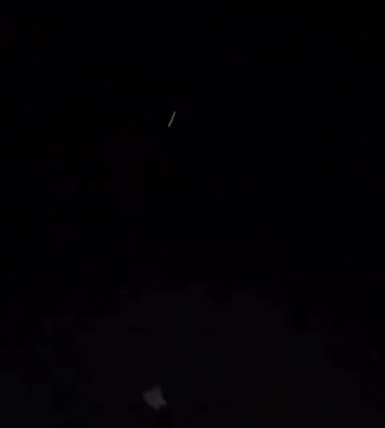 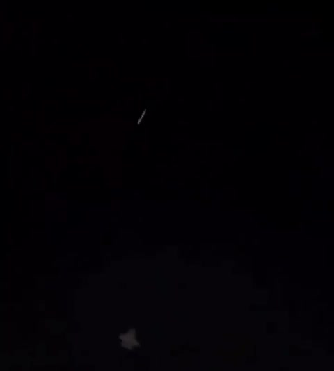  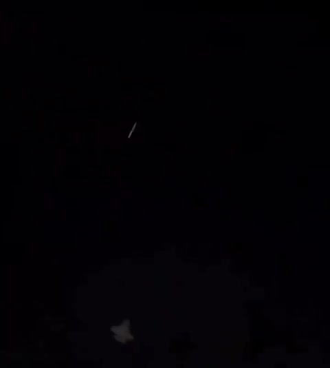 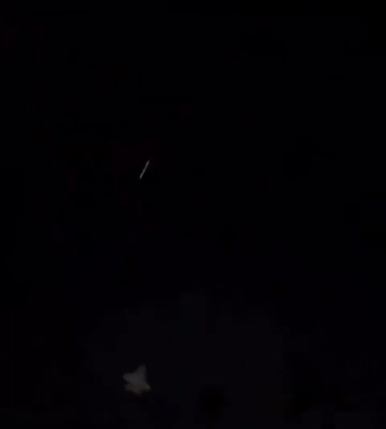  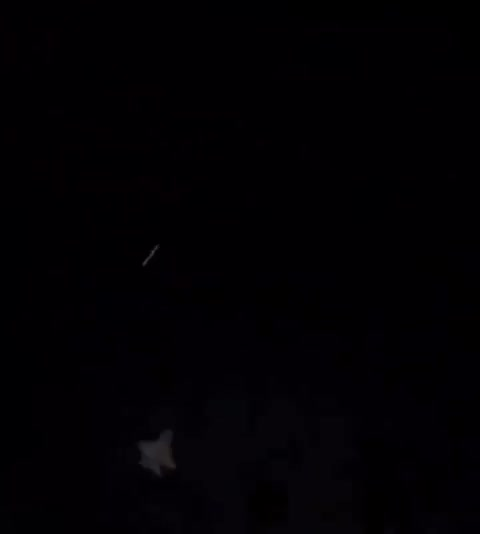 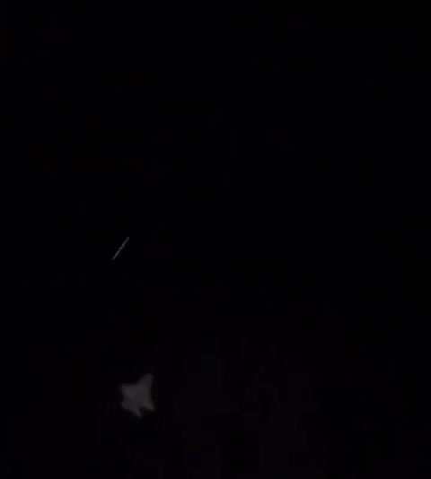   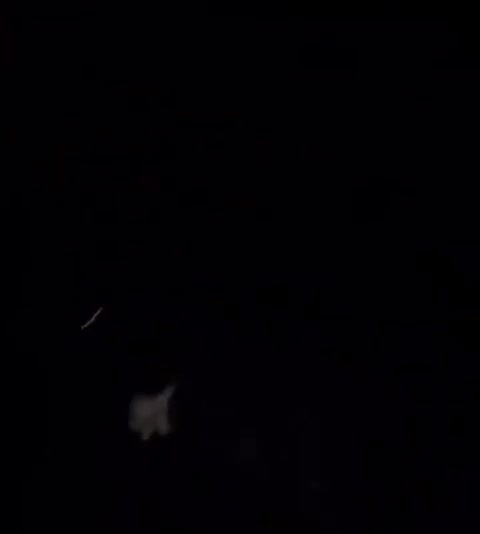 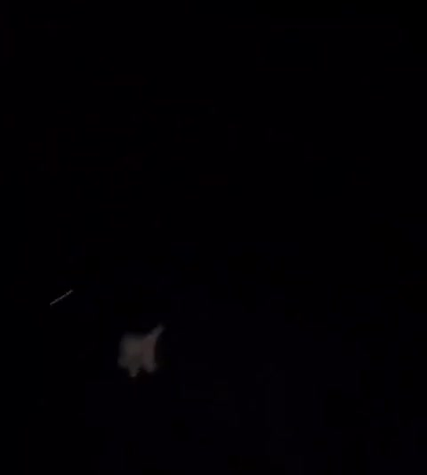  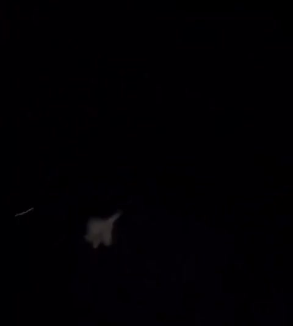 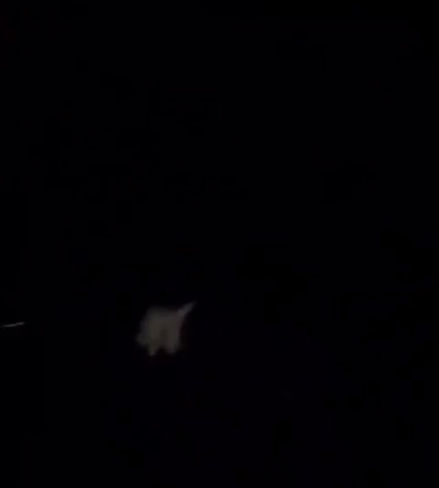 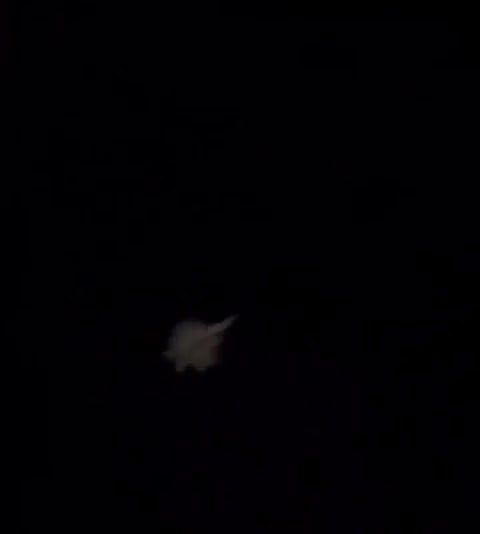 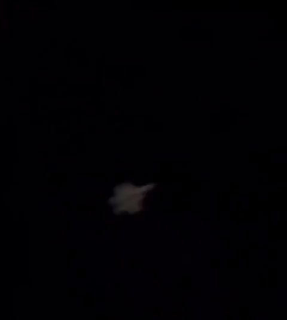 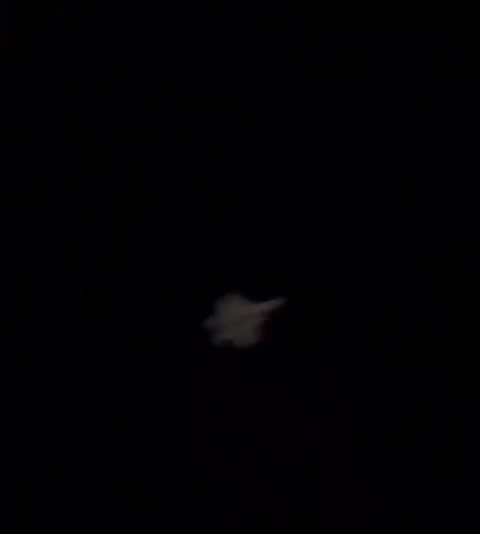 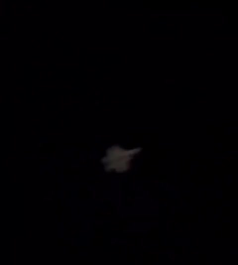 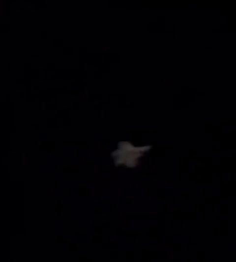     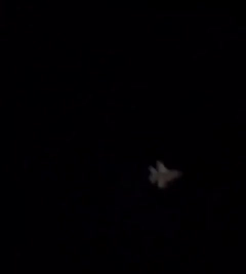 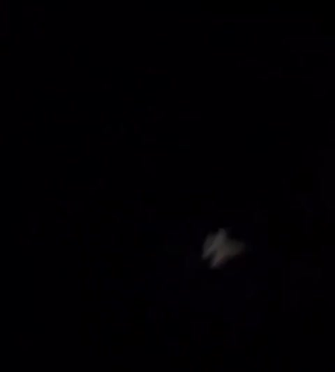 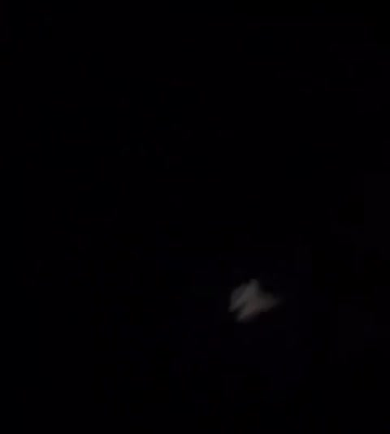  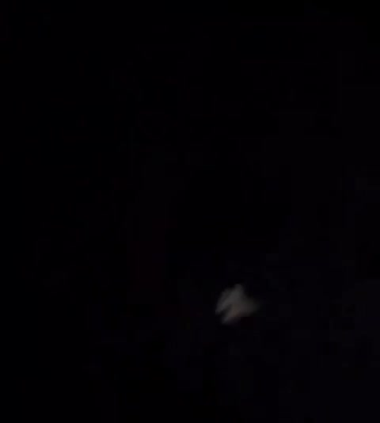 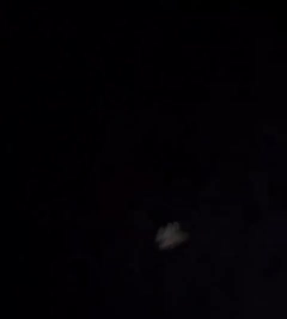 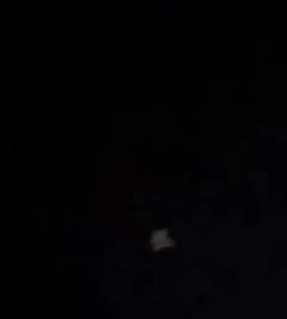 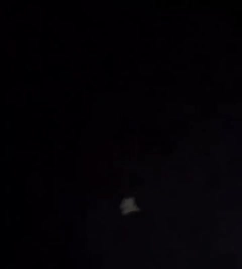   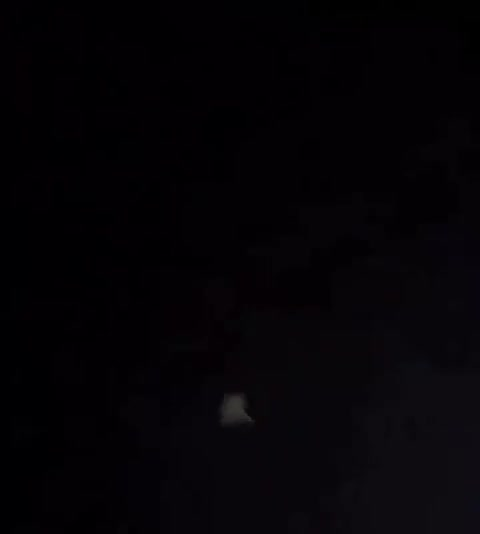   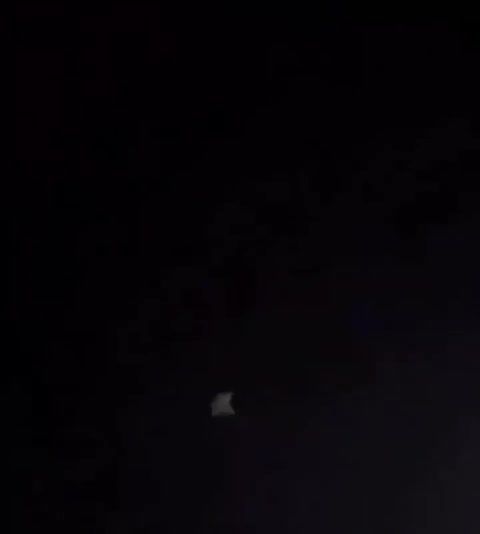       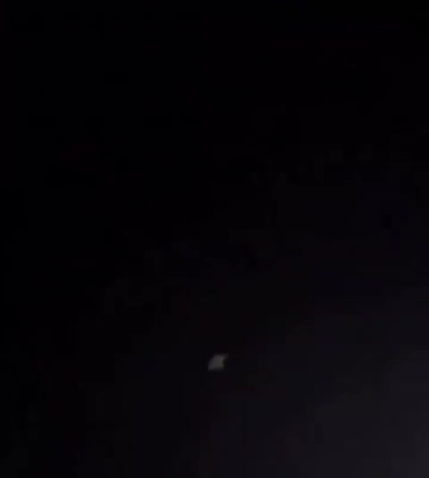 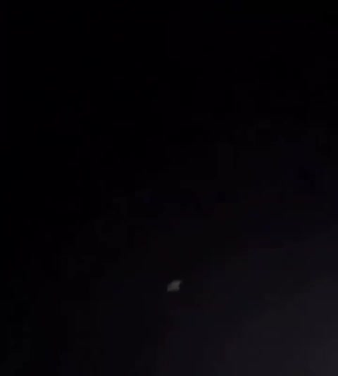 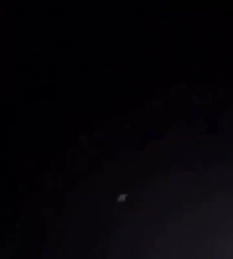                               
